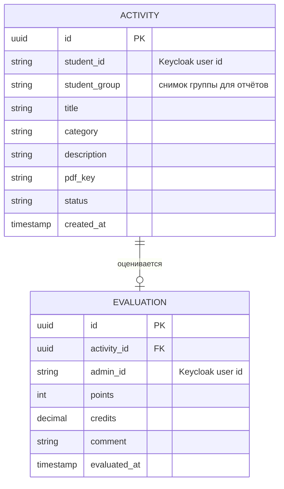
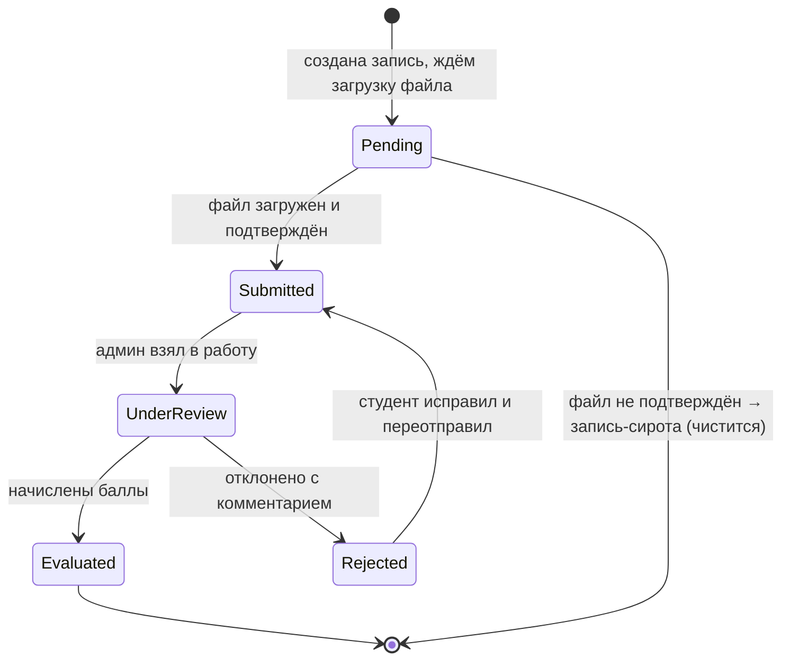
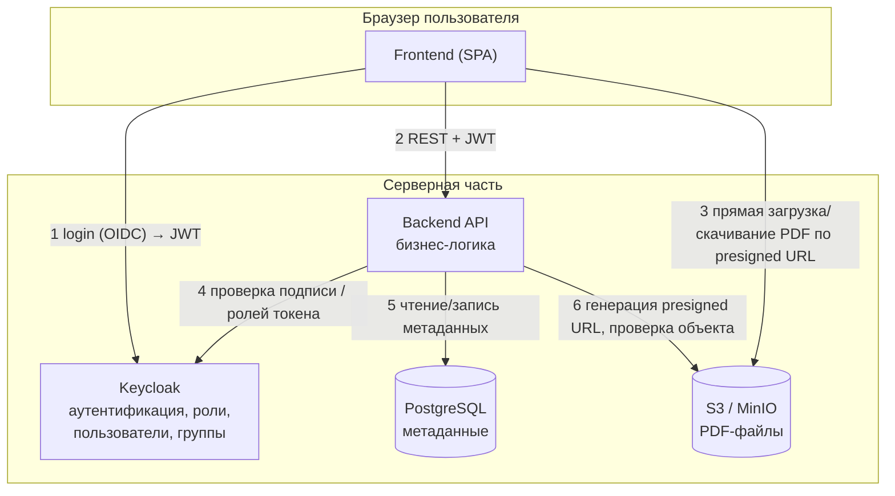
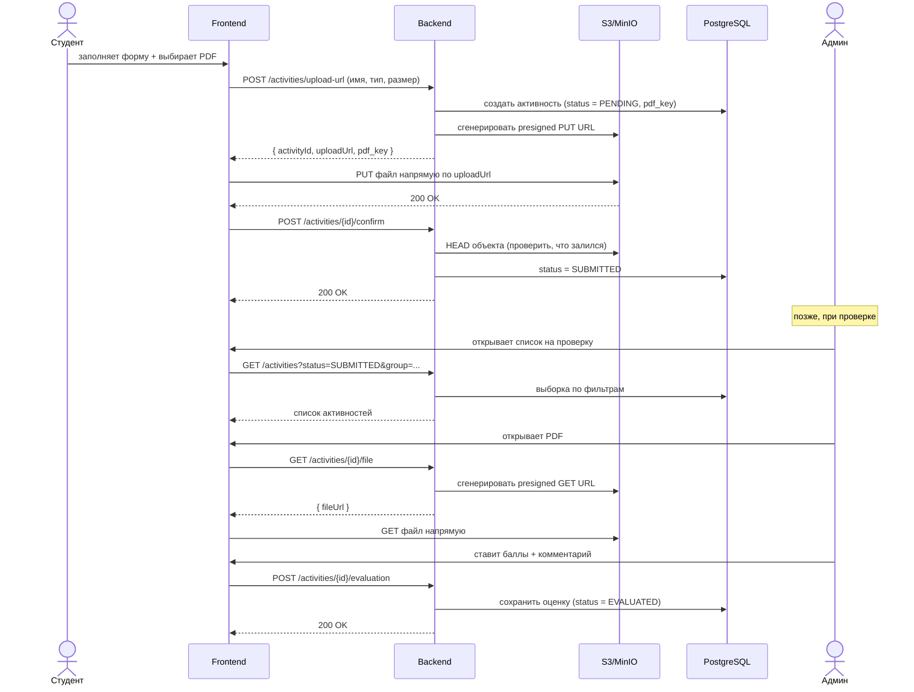
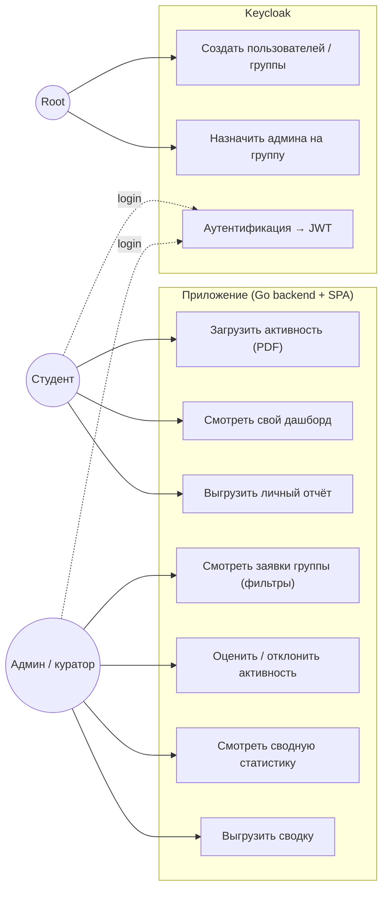

# Платформа учёта студенческих активностей — проектный документ

---

## 1. Краткое описание системы

Веб-платформа, на которой студенты в течение года загружают подтверждения своих активностей (олимпиады, конференции, волонтёрство, спорт, проекты и т.п.) в виде **PDF-документов**, а закреплённые за группами администраторы (кураторы) оценивают эти активности во **внутренней валюте (баллах)** и, опционально, в **академических з.е. / оценках**.

Каждый пользователь видит свою статистику: студент — по себе и своим достижениям (дашборд + выгрузка), администратор — сводную с фильтрами по студентам, группам, потокам, курсам и с возможностью экспорта.

Вся **аутентификация, авторизация, управление пользователями и группами вынесены в Keycloak**. Наше приложение не реализует регистрацию/логин самостоятельно — оно лишь проверяет токен и роли. Это сильно упрощает backend: в нём остаётся только бизнес-логика активностей и оценок.

**Файлы (PDF) хранятся в S3-совместимом хранилище** (AWS S3 или self-hosted MinIO), а в базе данных лежат только метаданные и ссылка (ключ объекта).

Базовая структура (root-пользователь, набор админов и студентов, привязка админов к группам) **настраивается через конфиг** при развёртывании.

---

## 2. Роли

| Роль | Где живёт | Что делает |
|------|-----------|------------|
| **Root (суперадмин)** | Keycloak | Создаёт админов и студентов, заводит группы/потоки/курсы, назначает админа на группу. Делает это в админ-консоли Keycloak / через конфиг. Своего UI в нашем приложении не требует. |
| **Admin (куратор группы)** | Keycloak (роль `admin`) | Видит активности студентов своей группы, проверяет их, начисляет баллы (и опц. з.е.), оставляет комментарий, смотрит сводную статистику и делает выгрузку. |
| **Student (студент)** | Keycloak (роль `student`) | Загружает активности (PDF + метаданные), отправляет на проверку, видит свой дашборд/достижения, выгружает свой отчёт. |

> Группы / потоки / курсы удобно моделировать **группами Keycloak** (иерархия `Курс → Поток → Группа`), а приложение читает их из токена/Keycloak Admin API. Альтернатива — дублировать структуру в нашей БД (см. раздел «Открытые решения»).

---

## 3. Модель данных (основные сущности)

> **Решение проекта:** пользователи, группы, потоки и курсы хранятся **целиком в Keycloak** (роли + иерархия групп `Курс → Поток → Группа`). В нашей БД **нет** таблиц `User` и `Group`. Это минимизирует код и убирает задачу синхронизации.

Что это меняет в данных:
- В активности храним **Keycloak-id студента** (а не FK на свою таблицу) и **снимок группы** (`student_group`) на момент подачи — чтобы строить статистику и фильтры без обращения к Keycloak на каждый запрос.
- ФИО, текущую группу/поток/курс и роли берём из **JWT** (для текущего пользователя) или через **Keycloak Admin API** (для списков студентов группы у админа).

Остаются всего две таблицы:

- **Activity** — активность студента: автор (Keycloak-id), снимок группы, заголовок, категория, описание, ключ PDF в S3, статус, дата.
- **Evaluation** — оценка активности администратором: баллы, опц. з.е., комментарий, кто (Keycloak-id) и когда оценил.

### Жизненный цикл активности

> При прямой загрузке в S3 (presigned URL) активность сначала создаётся в статусе `PENDING` — запись уже есть, но файл ещё не подтверждён. После успешной загрузки фронт зовёт `confirm`, и статус становится `SUBMITTED`. Незавершённые `PENDING`-записи (студент начал, но не догрузил) подчищаются фоновым заданием.
>
> Минимально-достаточный вариант для зачёта: `PENDING → SUBMITTED → EVALUATED / REJECTED`. Состояния `Draft` и `UnderReview` — приятное расширение.

---

## 4. Архитектура (как это работает)

Ключевая идея: **frontend логинится в Keycloak, получает JWT, ходит с ним в backend; backend проверяет токен/роль и работает с БД. Сами PDF фронт грузит и скачивает напрямую из S3 по временным (presigned) ссылкам — байты файла через backend не проходят.** Никакой собственной системы паролей и регистраций.

### Основной поток: загрузка и оценка активности

---

## 5. Страницы (UI)

### Студент
1. **Логин** — редирект в Keycloak (своей формы нет).
2. **Дашборд** — личная статистика: суммарные баллы, кол-во активностей по статусам, разбивка по категориям, достижения/бейджи, графики.
3. **Мои активности** — список своих заявок со статусами (на проверке / оценено / отклонено), фильтр по категории и статусу.
4. **Создание активности** — форма (заголовок, категория, описание) + загрузка PDF.
5. **Детали активности** — карточка с PDF-просмотром, статусом, начисленными баллами и комментарием куратора.
6. **Экспорт** — выгрузка личного отчёта (CSV / PDF).

### Администратор (куратор)
1. **Логин** — Keycloak.
2. **Дашборд (сводный)** — агрегаты с фильтрами: студент / группа / поток / курс / категория / период. Топ-студенты, распределение баллов.
3. **Активности на проверку** — список заявок (по умолчанию `SUBMITTED`), фильтры, сортировка.
4. **Проверка активности** — просмотр PDF + форма оценки: баллы, опц. з.е., комментарий, кнопки «оценить / отклонить».
5. **Студенты группы** — список студентов с их суммарными баллами и числом активностей.
6. **Экспорт** — выгрузка сводки по выбранным фильтрам (CSV / XLSX).

### Root
- Отдельного UI в приложении нет — всё в **админ-консоли Keycloak** (создание пользователей, групп, назначение ролей) + первичная настройка через конфиг.

---

## 6. API-ручки (минимальный набор)

| Метод | Ручка | Роль | Назначение |
|------|-------|------|------------|
| `POST` | `/activities/upload-url` | student | Создать активность (status=PENDING) + получить presigned PUT URL для загрузки PDF |
| `POST` | `/activities/{id}/confirm` | student | Подтвердить, что файл залит; backend проверяет объект в S3 → status=SUBMITTED |
| `GET` | `/activities/my` | student | Список своих активностей (**реализация 1** — скоуп «только мои») |
| `GET` | `/activities` | admin | Список активностей с фильтрами по группе/потоку/курсу/статусу (**реализация 2** — скоуп «группа куратора») |
| `GET` | `/activities/{id}` | student/admin | Детали активности |
| `GET` | `/activities/{id}/file` | student/admin | Получить presigned GET URL для просмотра/скачивания PDF |
| `POST` | `/activities/{id}/evaluation` | admin | Начислить баллы / з.е. / комментарий, сменить статус |
| `GET` | `/dashboard/me` | student | Агрегаты для студенческого дашборда |
| `GET` | `/dashboard/summary` | admin | Сводные агрегаты с фильтрами |
| `GET` | `/export/me` | student | Выгрузка личного отчёта |
| `GET` | `/export/summary` | admin | Выгрузка сводки по фильтрам |

> **Загрузка файла идёт напрямую в S3 (presigned URL), минуя backend.** Поток: `upload-url` (создаёт запись + ссылку) → фронт делает `PUT` в S3 → `confirm` (backend проверяет, что объект на месте). Байты PDF через backend не проходят.
>
> «Две реализации получения списка» из ТЗ — это `/activities/my` (студент видит только себя) и `/activities` (админ видит свою группу с фильтрами). Один и тот же набор сущностей, но разный скоуп и права.

---

## 7. Матрица прав (кратко)

| Действие | Student | Admin | Root |
|----------|:------:|:-----:|:----:|
| Создать активность | ✅ (свою) | — | — |
| Видеть активности | свои | своей группы | через Keycloak |
| Начислять баллы | — | ✅ | — |
| Сводная статистика | — | ✅ | — |
| Экспорт | свой | по группе | — |
| Создавать пользователей/группы | — | — | ✅ (Keycloak) |

Проверка прав — на стороне backend по ролям и принадлежности к группе из JWT.

---

## 8. Открытые решения

**✅ Зафиксировано:**
1. **Хранение пользователей/групп/потоков/курсов — только в Keycloak.** В нашей БД таблиц `User`/`Group` нет; в активности храним Keycloak-id студента + снимок группы.
2. **Backend — Go.**
3. **Загрузка/скачивание PDF — напрямую фронт ↔ S3 по presigned URL.** Backend выдаёт временные ссылки (короткий TTL), но сами байты файла через него не проходят.

**Ещё открыто (стоит решить до кода):**
4. **CORS на бакете.** Для прямой загрузки из браузера нужно настроить CORS-политику MinIO/S3 (разрешить `PUT`/`GET` с домена фронта).
5. **Валидация файла.** Тип/размер ограничиваем через `PresignedPostPolicy` (content-type + max size зашиты в политику) либо проверяем после загрузки в `confirm` (HEAD объекта → размер и `Content-Type`).
6. **Чистка осиротевших объектов.** `PENDING`-записи, для которых `confirm` так и не пришёл, нужно подчищать (фоновое задание по TTL + удаление объекта из S3).
7. **Правила начисления баллов.** Свободный ввод админом или диапазон баллов на категорию (через конфиг/справочник). Конвертация баллы → з.е. опциональна и тоже через конфиг.
8. **Глубина жизненного цикла.** 4 статуса (минимум: `PENDING → SUBMITTED → EVALUATED/REJECTED`) против 6 (с `Draft` и `UnderReview`).
9. **Чтение списка студентов группы.** Берём через Keycloak Admin API (gocloak) по требованию — кэшировать ли результат.

---

## 9. Юзкейсы

### Карта акторов и сценариев

### Описание основных сценариев

**UC-1. Загрузка активности.**
Актор: студент. Предусловие: авторизован (роль `student`).
Основной поток: заполняет форму (заголовок, категория, описание) и выбирает PDF → backend создаёт активность в статусе `PENDING` (со снимком группы из JWT) и возвращает presigned PUT URL → фронт грузит файл **напрямую в S3** → фронт вызывает `confirm` → backend проверяет объект (HEAD: тип/размер) и переводит статус в `SUBMITTED`. Результат: активность в списке «на проверку».
Альтернативный поток: `confirm` не пришёл (студент закрыл вкладку) → запись остаётся `PENDING` и позже удаляется фоновой чисткой вместе с недогруженным объектом.

**UC-2. Просмотр своего дашборда.**
Актор: студент. Backend агрегирует его активности (сумма баллов, разбивка по статусам и категориям, достижения). Результат: графики и цифры на дашборде.

**UC-3. Выгрузка личного отчёта.**
Актор: студент. Backend формирует CSV/XLSX по его активностям и оценкам. Результат: файл на скачивание.

**UC-4. Просмотр заявок группы.**
Актор: админ. Backend по роли и группе из JWT отдаёт активности студентов его группы с фильтрами (статус, категория, период, конкретный студент). Список студентов группы при необходимости тянется из Keycloak Admin API.

**UC-5. Оценка / отклонение активности.**
Актор: админ. Открывает PDF (presigned URL) → ставит баллы (опц. з.е.) и комментарий → статус `EVALUATED`, либо отклоняет → `REJECTED` с комментарием. Альтернативный поток: студент дорабатывает и переотправляет.

**UC-6. Сводная статистика.**
Актор: админ. Агрегаты с фильтрами студент/группа/поток/курс/категория/период: топ-студенты, распределение баллов, динамика.

**UC-7. Выгрузка сводки.**
Актор: админ. Экспорт текущей выборки (с учётом фильтров) в CSV/XLSX.

**UC-8/9. Администрирование (Keycloak).**
Актор: root. Создаёт пользователей и группы, назначает роли и привязывает админа к группе — в консоли Keycloak / через конфиг. Своего UI в приложении нет.

---

## 10. Технологии (стек)

| Слой | Технология | Зачем |
|------|-----------|-------|
| **Frontend** | React + TypeScript, Vite | SPA; OIDC-логин через библиотеку `keycloak-js` или `react-oidc-context` |
| **Backend** | **Go** | Основной язык команды |
| ↳ HTTP-роутер | **Gin** (или Echo / chi) | Маршрутизация, middleware. Gin — самый популярный и простой |
| ↳ OIDC / JWT | `coreos/go-oidc` + `golang.org/x/oauth2` | Проверка подписи токена по JWKS Keycloak, извлечение ролей и групп |
| ↳ Keycloak Admin | `Nerzal/gocloak` | Чтение списка студентов группы, групп/потоков/курсов |
| ↳ Доступ к БД | `pgx` + `sqlc` (типобезопасные запросы) или `GORM` (ORM, проще для старта) | Работа с PostgreSQL |
| ↳ Миграции | `golang-migrate` или `goose` | Версионирование схемы БД |
| ↳ S3-клиент | `minio-go` (или AWS SDK for Go v2) | Генерация presigned PUT/GET URL и проверка объектов (HEAD); работает и с S3, и с MinIO |
| ↳ Экспорт | `encoding/csv` (stdlib) + `xuri/excelize` | CSV и XLSX |
| ↳ Конфиг | `spf13/viper` или env-переменные | «Настройка через конфиг» из ТЗ |
| **IAM** | **Keycloak** | Аутентификация, роли, пользователи, группы/потоки/курсы |
| **БД** | **PostgreSQL** | Метаданные активностей и оценок |
| **Файлы** | **MinIO** (S3-совместимое) | Хранение PDF; фронт грузит/качает напрямую по presigned URL |
| **Инфраструктура** | **Docker Compose** | Поднимает backend + frontend + Keycloak + PostgreSQL + MinIO одной командой |

### Как собирается воедино
- `docker-compose.yml` поднимает все сервисы; Keycloak импортирует realm c ролями (`student`, `admin`), группами и тестовыми пользователями из JSON-конфига — это и есть «настройка через конфиг».
- Go-сервис на старте читает конфиг (Keycloak issuer/JWKS, DSN PostgreSQL, endpoint и ключи MinIO).
- Middleware валидирует JWT и кладёт роль + группу в контекст запроса; на их основе работает проверка прав в ручках.
- **MinIO настраивается с CORS-политикой**, разрешающей `PUT`/`GET` с домена фронтенда, — иначе прямая загрузка из браузера упрётся в CORS. Backend выдаёт presigned URL с коротким TTL; ограничение типа/размера задаётся через `PresignedPostPolicy` либо проверяется в `confirm`.
- Фоновое задание периодически удаляет `PENDING`-активности с истёкшим TTL вместе с недогруженными объектами в S3.

